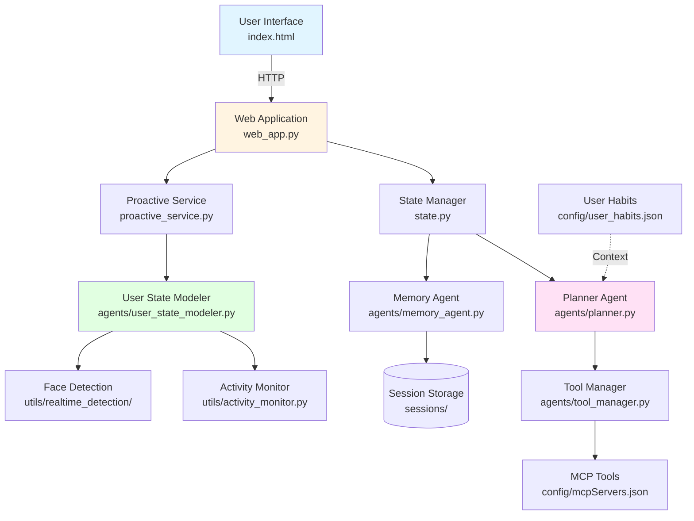
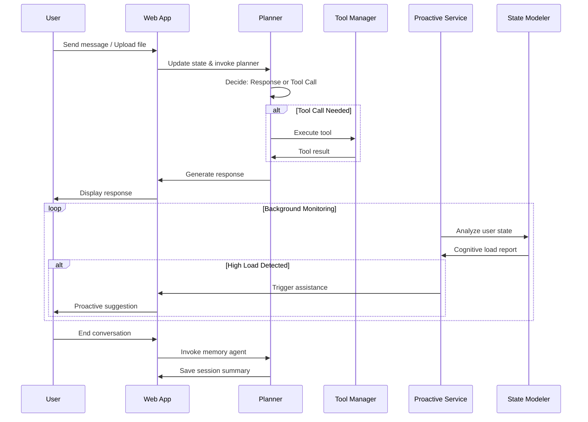

# PACE: 基于用户认知状态的主动服务对话框架

## 1. 项目简介

PACE 是一个支持主动服务的智能对话系统。它通过独立的用户认知状态建模模块，实时感知用户负荷，并在需要时主动发起服务建议。框架将认知建模与对话逻辑解耦，支持多模态输入（文本、文件、图片），可扩展多种工具服务。

**核心特性**：
- 🧠 实时认知负荷建模（键鼠活动 + 视觉检测）
- 🤖 主动服务建议（基于 LLM 或启发式规则）
- 🔧 可扩展工具集成（MCP 协议）
- 💾 会话状态持久化与记忆总结
- 🎨 多模态输入支持（文本/图片/文件）

**平台支持**：macOS (Apple Silicon) / Windows

## 2. 快速开始

### 环境准备

```bash
# 1. 克隆项目并进入目录
cd CHI26/CogAgent

# 2. 创建虚拟环境
python3 -m venv .venv
source .venv/bin/activate  # Windows: .venv\Scripts\activate

# 3. 安装依赖
pip install -r requirements.txt  # 或 requirements-macos.txt

# 4. 配置环境变量
cp .env.example .env  # 编辑填写 API 密钥（OPENAI_API_KEY 等）

# 5. 检查环境
python check_system.py

# 6. 启动服务
hypercorn web_app:app --bind 0.0.0.0:5001
# 访问 http://127.0.0.1:5001
```

### 权限要求（macOS）
- **辅助功能**：键鼠监控
- **屏幕录制**：窗口信息获取
- **摄像头**：认知负荷检测

详见 [INSTALL_MACOS.md](INSTALL_MACOS.md)

## 3. 系统架构



### 核心流程



## 4. 代码结构

```
CogAgent/
├── agents/                      # 核心 Agent 模块
│   ├── planner.py              # 决策 Agent（LangGraph 节点）
│   ├── tool_manager.py         # MCP 工具执行器
│   ├── user_state_modeler.py   # 认知状态分析
│   └── memory_agent.py         # 会话记忆总结
├── config/                      # 配置文件
│   ├── mcpServers.json         # MCP 工具服务器定义
│   └── user_habits.json        # 用户习惯与偏好
├── utils/                       # 工具函数
│   ├── helpers.py              # 通用辅助函数
│   ├── mcp_config_loader.py    # MCP 配置加载
│   ├── activity_monitor.py     # 键鼠活动监控
│   ├── face_thread.py          # 视觉检测线程
│   └── realtime_detection/     # 认知负荷检测模型
│       ├── face_detection.py   # 面部检测
│       ├── model.py            # ResNet3D 模型定义
│       └── best_resnet3d.pth   # 预训练模型（需自行获取）
├── templates/                   # 前端模板
│   └── index.html              # 主界面
├── static/                      # 前端资源
│   ├── style.css
│   └── chart.js
├── sessions/                    # 会话状态存储（自动生成）
├── web_app.py                   # 主应用入口（Quart 服务器）
├── proactive_service.py         # 主动服务后台线程
├── state.py                     # AgentState 类型定义
├── check_system.py              # 环境检查脚本
└── requirements.txt             # Python 依赖
```

## 5. 核心模块说明

### agents/

| 模块 | 功能 | 关键技术 |
|------|------|----------|
| `planner.py` | 对话决策核心，根据上下文决定回复或工具调用 | LangChain, LangGraph |
| `tool_manager.py` | 异步执行 MCP 工具，处理工具调用结果 | MCP Protocol, asyncio |
| `user_state_modeler.py` | 分析用户活动快照，评估认知负荷，生成服务建议 | LLM 推理或启发式规则 |
| `memory_agent.py` | 会话结束后提炼关键信息并存储 | LangChain |

### web_app.py（主应用）

- **框架**：Quart（异步 Flask）
- **路由**：
  - `/`：主界面
  - `/chat`：处理用户消息（文本/图片/文件）
  - `/listen`：SSE 事件流（实时推送 Agent 响应）
  - `/request_assistance`：主动服务触发
  - `/end_chat`：结束会话并保存记忆
- **功能**：会话管理、状态持久化、多模态输入处理

### proactive_service.py（后台服务）

- 独立线程周期性监控用户状态（键鼠频率、窗口信息、认知负荷）
- 调用 `user_state_modeler` 分析并决策是否触发主动服务
- 通过 `/request_assistance` 接口与主 Agent 协作

### utils/

- **activity_monitor.py**：跨平台键鼠事件监听（pynput）
- **face_thread.py**：视频流处理与认知负荷实时检测
- **realtime_detection/**：ResNet3D 模型推理（支持 CUDA/MPS/CPU）

## 6. 配置说明

### 环境变量（`.env`）

```bash
# LLM API（必需）
OPENAI_API_KEY=sk-xxx
# 或使用 Azure OpenAI / Google Gemini

# 可选配置
PROACTIVE_DECISION_MODE=llm  # llm（默认）或 heuristic
GITHUB_TOKEN=ghp_xxx         # 用于 GitHub MCP 工具
```

### MCP 工具配置（`config/mcpServers.json`）

定义可用的工具服务器（PPT、图表、文件系统等），示例：

```json
{
  "ppt": {
    "command": "node",
    "args": ["path/to/ppt-server/index.js"]
  }
}
```

### 用户习惯（`config/user_habits.json`）

存储用户偏好，作为 SystemMessage 注入对话上下文。

## 7. 技术栈

| 层级 | 技术 |
|------|------|
| **后端框架** | Python 3.9+ + Quart（异步） |
| **AI 框架** | LangChain + LangGraph |
| **LLM 支持** | OpenAI / Azure OpenAI / Google Gemini |
| **工具协议** | MCP (Model Context Protocol) |
| **深度学习** | PyTorch（CUDA/MPS/CPU 自适应） |
| **计算机视觉** | OpenCV + ResNet3D |
| **前端** | HTML5 + JavaScript + Chart.js |

## 8. 扩展开发

### 添加新工具

1. 在 `config/mcpServers.json` 中定义工具服务器
2. 系统自动发现并将工具注入 Planner

### 自定义决策逻辑

修改 `agents/planner.py` 中的决策节点，或调整 `user_state_modeler.py` 的分析策略。

### 替换认知负荷模型

替换 `utils/realtime_detection/best_resnet3d.pth`，并调整 `model.py` 中的模型定义。

---

**隐私说明**：本系统在本地收集键鼠活动、窗口信息和视频数据用于认知负荷分析，所有数据均在本地处理，不上传云端。

如需详细开发文档，请参考各模块源码注释或联系项目维护者。
