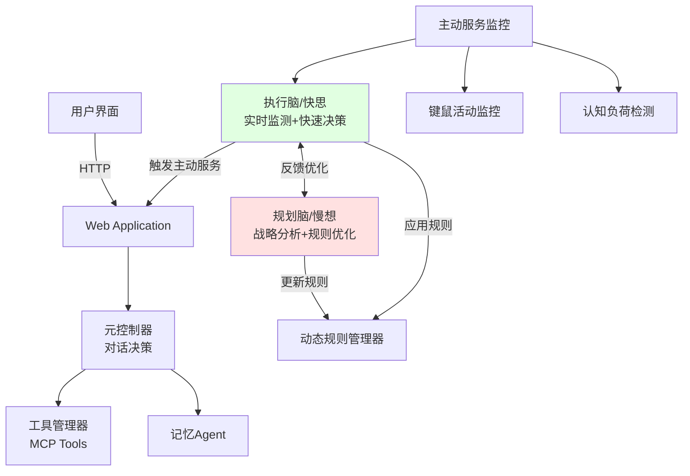

# PACE: 基于用户认知状态的主动服务对话框架

## 1. 项目简介

PACE 是一个支持主动服务的智能对话系统，采用"快思慢想"双脑架构，通过实时认知负荷建模和战略意图分析，在需要时主动发起服务建议。

**核心特性**：
- 🧠 双脑架构（执行脑/快思 + 规划脑/慢想）
- 📊 实时认知负荷建模（键鼠活动 + 视觉检测）
- 🤖 智能主动服务（启发式规则 + LLM 决策）
- 🔧 动态策略优化（基于用户反馈自适应调整）
- 💾 会话状态持久化与记忆总结
- 🎨 多模态输入支持（文本/图片/文件）

**平台支持**：macOS (Apple Silicon) / Windows

## 2. 快速开始

```bash
# 1. 环境准备
cd CHI26/CogAgent
python3 -m venv .venv
source .venv/bin/activate  # Windows: .venv\Scripts\activate
pip install -r requirements.txt

# 2. 配置环境变量
cp .env.example .env  # 编辑填写 GOOGLE_API_KEY

# 3. 启动服务
hypercorn web_app:app --bind 0.0.0.0:5001
# 访问 http://127.0.0.1:5001
```

**权限要求（macOS）**：辅助功能、屏幕录制、摄像头

## 3. 系统架构

### 核心设计："快思慢想"双脑系统



### 双脑架构详解

**执行脑（Executor Brain / 快思）**
- **调用频率**：高频（每30秒）
- **功能**：实时监测用户状态，快速决策是否触发主动服务
- **模式**：启发式规则（推荐）或 LLM 推理
- **文件**：`agents/executor_brain.py`

**规划脑（Planner Brain / 慢想）**
- **调用频率**：低频（用户反馈后、关键时刻）
- **功能**：分析用户反馈，动态调整规则参数，战略对话分析
- **文件**：`agents/planner_brain.py`

## 4. 实验模式

系统支持**实验组**和**对照组**两种模式，用于验证动态规则学习和认知效益分析的效果。

### 实验组（默认）

```bash
# .env 配置
EXPERIMENT_MODE=experimental
```

**核心创新**：
- ✅ **动态规则学习**：规划脑根据用户反馈自动调整权重和阈值
- ✅ **认知效益分析**：基于"卸载效益-交互成本"模型生成个性化帮助
- ✅ **战略意图理解**：深度分析用户长期意图，指导主动服务方向

### 对照组（PUM Baseline）

```bash
# .env 配置
EXPERIMENT_MODE=baseline
```

**特点**：
- ⛔ **固定规则参数**：权重和阈值永不改变（认知负荷0.5，卡壳0.3，窗口切换0.1，心流-0.2，阈值40）
- ⛔ **通用帮助内容**：使用固定模板，无个性化分析
- ⛔ **简单二元决策**：仅判断是否需要干预，无深度推理

**对比维度**：
1. **触发准确性**：实验组动态优化，对照组固定参数
2. **帮助质量**：实验组个性化 vs 对照组通用内容
3. **用户体验**：实验组战略化询问 vs 对照组固定询问

## 5. 代码结构

```
CogAgent/
├── agents/                      # 核心 Agent 模块
│   ├── meta_controller.py      # 元控制器（对话决策）
│   ├── planner_brain.py        # 规划脑（慢想系统）
│   ├── executor_brain.py       # 执行脑（快思系统）
│   ├── pum_baseline.py         # 【对照组】PUM基线模块
│   ├── tool_manager.py         # MCP 工具执行器
│   ├── memory_agent.py         # 会话记忆总结
│   └── prompts.py              # Prompt 模板
├── config/
│   ├── mcpServers.json         # MCP 工具配置
│   ├── user_habits.json        # 用户习惯
│   └── dynamic_rules.json      # 动态规则（实验组生成）
├── utils/
│   ├── activity_monitor.py     # 键鼠监控
│   ├── face_thread.py          # 视觉检测线程
│   ├── dynamic_rules.py        # 动态规则管理器
│   └── realtime_detection/     # ResNet3D 认知负荷模型
├── web_app.py                   # 主应用（Quart）
├── proactive_service.py         # 主动服务监控
├── state.py                     # AgentState 定义
└── .env.example                 # 环境变量模板
```

## 6. 核心模块

| 模块 | 功能 | 调用频率 |
|------|------|----------|
| `meta_controller.py` | 对话决策核心，多模态输入处理，记忆检索 | 每次用户输入 |
| `planner_brain.py` | 规划脑：战略分析、策略优化 | 低频（关键时刻） |
| `executor_brain.py` | 执行脑：实时监测、快速决策 | 高频（每30秒） |
| `pum_baseline.py` | 对照组基线：固定规则、通用帮助 | 高频（每30秒，对照组时） |
| `tool_manager.py` | 异步执行 MCP 工具 | 按需调用 |
| `memory_agent.py` | 会话总结并存储到记忆库 | 会话结束时 |

## 7. 配置说明

### 环境变量（`.env`）

```bash
# LLM API（必需）
GOOGLE_API_KEY=your_google_api_key_here

# 实验模式（用于对比实验）
EXPERIMENT_MODE=experimental     # experimental（实验组）或 baseline（对照组）

# 决策模式
PROACTIVE_DECISION_MODE=heuristic  # heuristic（推荐）或 llm

# MCP 工具（可选）
GITHUB_TOKEN=ghp_xxx
```

### 决策模式对比

| 模式 | 响应速度 | 成本 | 准确度 | 适用场景 |
|------|----------|------|--------|----------|
| **heuristic**（推荐） | 毫秒级 | 低 | 高（动态优化） | 生产环境 |
| **llm** | 秒级 | 高 | 高（深度推理） | 研究实验 |

### 双模型策略

- **llm_pro**（gemini-2.5-pro）：用于复杂推理（元控制器、认知效益分析、规划脑）
- **llm_flash**（gemini-2.0-flash）：用于高频任务（执行脑、记忆总结）

## 8. 主要路由

| 路由 | 方法 | 功能 |
|------|------|------|
| `/` | GET | 主界面 |
| `/chat` | POST | 处理用户消息（文本/图片/文件） |
| `/listen` | GET | SSE 事件流（实时推送响应） |
| `/request_assistance` | POST | 用户接受主动服务 |
| `/reject_assistance` | POST | 用户拒绝主动服务 |
| `/end_chat` | POST | 结束会话并保存记忆 |

## 9. 技术栈

| 层级 | 技术 |
|------|------|
| **后端** | Python 3.9+ + Quart（异步） |
| **AI 框架** | LangChain + LangGraph |
| **LLM** | Google Gemini / OpenAI 兼容 API |
| **记忆数据库** | Mem0 (MCP) |
| **工具协议** | MCP (Model Context Protocol) |
| **深度学习** | PyTorch（CUDA/MPS/CPU） |
| **视觉** | OpenCV + ResNet3D |
| **前端** | HTML5 + JavaScript + Chart.js |

## 10. 扩展开发

### 添加新工具
在 `config/mcpServers.json` 中定义工具服务器，系统自动发现并注入。

### 自定义决策策略
- **调整权重**：修改 `config/dynamic_rules.json` 或通过用户反馈让规划脑自动优化
- **修改逻辑**：编辑 `agents/executor_brain.py` 的 `_heuristic_decision()` 方法

### 替换认知负荷模型
替换 `utils/realtime_detection/best_resnet3d.pth` 并调整 `model.py` 的模型定义。

## 11. 实验指南

### 对照组测试（建议1-2周）

```bash
# 1. 配置对照组模式
echo "EXPERIMENT_MODE=baseline" >> .env

# 2. 启动系统
hypercorn web_app:app --bind 0.0.0.0:5001

# 3. 收集数据
# - 触发事件数、用户接受率、帮助有效性
```

### 实验组测试（建议1-2周）

```bash
# 1. 切换到实验组模式
echo "EXPERIMENT_MODE=experimental" >> .env

# 2. 启动系统（从固定参数开始）
hypercorn web_app:app --bind 0.0.0.0:5001

# 3. 观察规则演化
# - 查看 config/dynamic_rules.json 的变化
# - 分析接受率提升趋势
```

### 对比分析

- **触发准确性**：对照组固定 vs 实验组动态优化
- **帮助质量**：通用内容 vs 个性化认知效益分析
- **用户体验**：固定询问 vs 战略化询问

---

**隐私说明**：本系统在本地收集键鼠活动、窗口信息和视频数据用于认知负荷分析，所有数据均在本地处理，不上传云端。

**文档**：详细开发文档请参考各模块源码注释。
