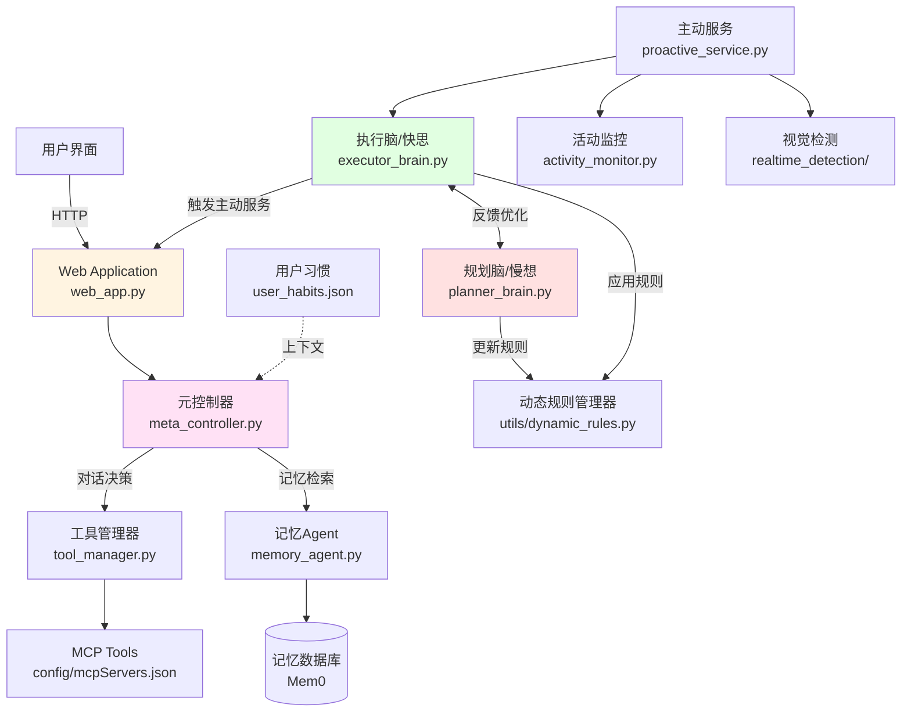
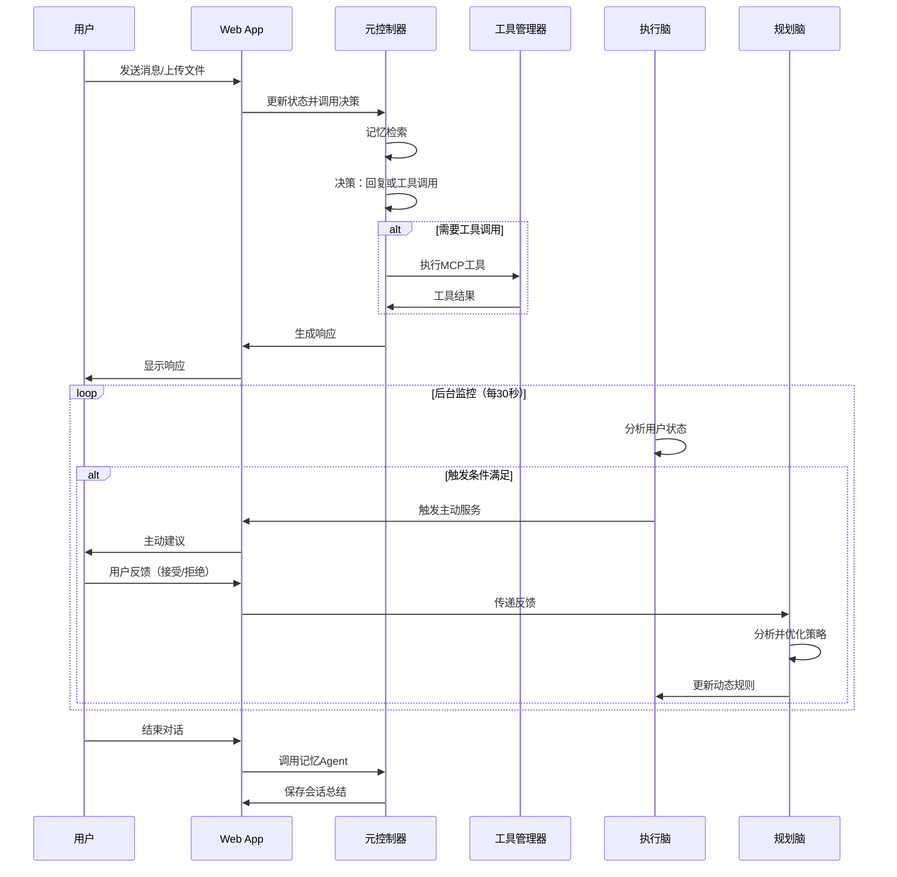

# PACE: 基于用户认知状态的主动服务对话框架

## 1. 项目简介

PACE 是一个支持主动服务的智能对话系统，采用"快思慢想"双脑架构，通过实时认知负荷建模和战略意图分析，在需要时主动发起服务建议。框架支持多模态输入（文本、文件、图片），可扩展多种工具服务。

**核心特性**：
- 🧠 双脑架构（执行脑/快思 + 规划脑/慢想）
- 📊 实时认知负荷建模（键鼠活动 + 视觉检测）
- 🤖 智能主动服务（启发式规则 + LLM 决策）
- 🔧 动态策略优化（基于用户反馈自适应调整）
- 💾 会话状态持久化与记忆总结
- 🎨 多模态输入支持（文本/图片/文件）

**平台支持**：macOS (Apple Silicon) / Windows

## 2. 快速开始

### 环境准备

```bash
# 1. 克隆项目并进入目录
cd CHI26/CogAgent

# 2. 创建虚拟环境
python3 -m venv .venv
source .venv/bin/activate  # Windows: .venv\Scripts\activate

# 3. 安装依赖
pip install -r requirements.txt  # 或 requirements-macos.txt

# 4. 配置环境变量
cp .env.example .env  # 编辑填写 API 密钥（OPENAI_API_KEY 等）

# 5. 检查环境
python check_system.py

# 6. 启动服务
hypercorn web_app:app --bind 0.0.0.0:5001
# 访问 http://127.0.0.1:5001
```

### 权限要求（macOS）
- **辅助功能**：键鼠监控
- **屏幕录制**：窗口信息获取
- **摄像头**：认知负荷检测

## 3. 系统架构

### 核心设计："快思慢想"双脑系统



### 双脑架构详解

**执行脑（Executor Brain / 快思系统）**
- **调用频率**：高频（每30秒）
- **功能**：
  - 实时用户状态监测（键鼠频率、窗口信息、认知负荷）
  - 快速决策是否触发主动服务
  - 支持启发式规则或LLM两种决策模式
- **关键类**：`UserStateModeler` (executor_brain.py:31)

**规划脑（Planner Brain / 慢想系统）**
- **调用频率**：低频（用户反馈后、关键时刻）
- **功能**：
  - 分析用户反馈（接受/拒绝主动服务）
  - 动态调整规则参数（权重、阈值）
  - 战略对话分析（长期意图、任务模式识别）
  - 生成战略指导方向
- **关键类**：`PlannerBrain` (planner_brain.py:29)

### 核心流程



## 4. 代码结构

```
CogAgent/
├── agents/                           # 核心 Agent 模块
│   ├── meta_controller.py           # 元控制器（对话决策核心）
│   ├── planner_brain.py             # 规划脑（慢想系统）
│   ├── executor_brain.py            # 执行脑（快思系统，含UserStateModeler）
│   ├── tool_manager.py              # MCP 工具执行器
│   ├── memory_agent.py              # 会话记忆总结
│   └── prompts.py                   # 统一的 Prompt 模板
├── config/                           # 配置文件
│   ├── mcpServers.json              # MCP 工具服务器定义
│   └── user_habits.json             # 用户习惯与偏好
├── utils/                            # 工具函数
│   ├── helpers.py                   # 通用辅助函数
│   ├── mcp_config_loader.py         # MCP 配置加载
│   ├── activity_monitor.py          # 键鼠活动监控
│   ├── face_thread.py               # 视觉检测线程
│   ├── dynamic_rules.py             # 动态规则管理器
│   └── realtime_detection/          # 认知负荷检测模型
│       ├── face_detection.py        # 面部检测
│       ├── model.py                 # ResNet3D 模型定义
│       └── best_resnet3d.pth        # 预训练模型（需自行获取）
├── templates/                        # 前端模板
│   └── index.html                   # 主界面
├── static/                           # 前端资源
│   ├── style.css
│   └── chart.js
├── sessions/                         # 会话状态存储（自动生成）
├── web_app.py                        # 主应用入口（Quart 服务器）
├── proactive_service.py              # 主动服务后台监控
├── state.py                          # AgentState 类型定义
├── check_system.py                   # 环境检查脚本
└── requirements.txt                  # Python 依赖
```

## 5. 核心模块说明

### agents/

| 模块 | 功能 | 调用频率 | 关键技术 |
|------|------|----------|----------|
| `meta_controller.py` | 对话决策核心，处理多模态输入，记忆检索，决定回复或工具调用 | 每次用户输入 | LangChain, LangGraph |
| `planner_brain.py` | 规划脑（慢想系统），战略分析和策略优化 | 低频（关键时刻） | LLM 推理 |
| `executor_brain.py` | 执行脑（快思系统），实时状态监测和快速决策 | 高频（每30秒） | 启发式规则/LLM |
| `tool_manager.py` | 异步执行 MCP 工具，处理工具调用结果 | 按需调用 | MCP Protocol, asyncio |
| `memory_agent.py` | 会话结束后提炼关键信息并存储到记忆数据库 | 会话结束时 | LangChain, Mem0 |

### web_app.py（主应用）

- **框架**：Quart（异步 Flask）
- **双模型策略**：
  - `llm_pro` (gemini-3-pro-preview): 用于复杂推理（元控制器、认知效益分析）
  - `llm_flash` (gemini-2.0-flash): 用于高频任务（状态决策、记忆总结）
- **路由**：
  - `/`：主界面
  - `/chat`：处理用户消息（文本/图片/文件）
  - `/listen`：SSE 事件流（实时推送 Agent 响应）
  - `/request_assistance`：主动服务触发
  - `/feedback`：用户反馈处理（传递给规划脑）
  - `/end_chat`：结束会话并保存记忆

### proactive_service.py（后台服务）

- 独立线程周期性监控用户状态（每5秒更新数据，每30秒决策一次）
- 调用执行脑 (`UserStateModeler`) 进行快速决策
- 在关键时刻触发规划脑进行战略分析：
  - 首次分析（消息数≥5）
  - 检测到错误关键词
  - 连续触发多次
  - 高负荷持续时间过长

### utils/dynamic_rules.py（动态规则管理器）

- 管理启发式决策的权重和阈值参数
- 持久化到 `config/dynamic_rules.json`
- 支持规划脑动态更新

## 6. 配置说明

### 环境变量（`.env`）

```bash
# LLM API（必需）
OPENAI_API_KEY=sk-xxx
OPENAI_BASE_URL=https://api.your-provider.com  # 可选：第三方API

# 可选配置
PROACTIVE_DECISION_MODE=heuristic  # heuristic（推荐）或 llm
GITHUB_TOKEN=ghp_xxx               # 用于 GitHub MCP 工具
```

### MCP 工具配置（`config/mcpServers.json`）

定义可用的工具服务器（PPT、图表、文件系统等），示例：

```json
{
  "mcpServers": {
    "ppt": {
      "command": "node",
      "args": ["path/to/ppt-server/index.js"]
    },
    "memory": {
      "command": "python",
      "args": ["-m", "mem0", "server"]
    }
  }
}
```

### 用户习惯（`config/user_habits.json`）

存储用户偏好，作为 SystemMessage 注入对话上下文。

### 动态规则（`config/dynamic_rules.json`）

由规划脑自动管理，包含启发式决策的权重和阈值参数。

## 7. 技术栈

| 层级 | 技术 |
|------|------|
| **后端框架** | Python 3.9+ + Quart（异步） |
| **AI 框架** | LangChain + LangGraph |
| **LLM 支持** | OpenAI / 第三方 API（兼容 OpenAI 格式） |
| **记忆数据库** | Mem0 (MCP) |
| **工具协议** | MCP (Model Context Protocol) |
| **深度学习** | PyTorch（CUDA/MPS/CPU 自适应） |
| **计算机视觉** | OpenCV + ResNet3D |
| **前端** | HTML5 + JavaScript + Chart.js |

## 8. 决策模式选择

### 启发式模式（推荐）

```bash
PROACTIVE_DECISION_MODE=heuristic
```

**优点**：
- ⚡ 响应快（毫秒级）
- 💰 成本低（无 LLM 调用）
- 🎯 可控性强（基于明确规则）
- 📈 可自适应（规划脑动态优化参数）

**适用场景**：生产环境、高频监控、成本敏感

### LLM 模式

```bash
PROACTIVE_DECISION_MODE=llm
```

**优点**：
- 🧠 理解力强（自然语言推理）
- 🎯 准确度高（复杂场景判断）

**缺点**：
- ⏱️ 响应慢（秒级）
- 💸 成本高（每30秒一次调用）

**适用场景**：研究实验、复杂任务识别

## 9. 扩展开发

### 添加新工具

1. 在 `config/mcpServers.json` 中定义工具服务器
2. 系统自动发现并将工具注入元控制器

### 自定义决策策略

- **调整权重**：修改 `config/dynamic_rules.json` 或通过用户反馈让规划脑自动优化
- **修改决策逻辑**：编辑 `agents/executor_brain.py` 中的 `_heuristic_decision()` 方法
- **战略分析逻辑**：编辑 `agents/planner_brain.py` 中的 `analyze_conversation_strategy()` 方法

### 替换认知负荷模型

替换 `utils/realtime_detection/best_resnet3d.pth`，并调整 `model.py` 中的模型定义。

---

**隐私说明**：本系统在本地收集键鼠活动、窗口信息和视频数据用于认知负荷分析，所有数据均在本地处理，不上传云端。

如需详细开发文档，请参考各模块源码注释或联系项目维护者。
