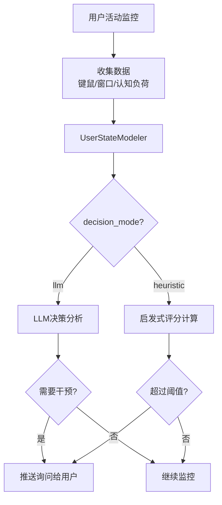

# 主动服务决策模式配置指南

## 概述

CogAgent 支持两种主动服务触发决策模式：

1. **LLM模式 (推荐)**: 使用大语言模型智能分析用户状态，决定是否触发主动服务
2. **启发式模式**: 使用预定义的加权评分规则计算得分，超过阈值则触发

## 配置方法

### 环境变量配置

在 `.env` 文件或环境变量中设置：

```bash
# 主动服务决策模式
# 可选值: "llm" (默认) 或 "heuristic"
PROACTIVE_DECISION_MODE=llm
```

### 启动应用

```bash
# 使用LLM模式（默认）
./start_server.sh

# 或临时切换为启发式模式
PROACTIVE_DECISION_MODE=heuristic hypercorn web_app:app --bind 0.0.0.0:5001
```

## 决策模式对比

### LLM模式 (decision_mode="llm")

**优点：**
- ✅ 智能决策：LLM综合考虑多维度信息，做出更合理的判断
- ✅ 上下文理解：能理解用户当前的工作状态和任务类型
- ✅ 动态适应：根据具体情况灵活调整决策标准
- ✅ 友好询问：生成针对性的、上下文相关的询问语

**缺点：**
- ⚠️ API调用成本：每次决策需要调用LLM API
- ⚠️ 响应延迟：LLM推理需要1-3秒
- ⚠️ 依赖外部服务：需要LLM服务可用

**适用场景：**
- 追求更好的用户体验
- API成本可接受
- 网络连接稳定

**决策日志示例：**
```
--- LLM Decision Mode: Invoking LLM for proactive service decision ---
LLM Decision: needs_intervention=True, confidence=0.85
Reasoning: 用户认知负荷持续较高(High Load, 置信度82%)，且键鼠活动极低(0.2 Hz)，
          可能遇到了技术难题或陷入思考。
Key Factors: ['高认知负荷', '低键鼠活动', '稳定窗口']
```

---

### 启发式模式 (decision_mode="heuristic")

**优点：**
- ✅ 零成本：无API调用，完全离线运行
- ✅ 快速响应：决策延迟 <10ms
- ✅ 可预测：基于明确规则，行为稳定
- ✅ 可调优：可通过修改权重和阈值精细调整

**缺点：**
- ⚠️ 规则固定：无法理解复杂的上下文情况
- ⚠️ 可能误判：在边缘情况下可能过度触发或漏触发
- ⚠️ 通用询问：生成的询问语较为通用

**适用场景：**
- 成本敏感场景
- 离线环境或网络不稳定
- 快速响应优先

**决策日志示例：**
```
--- User State Score (Heuristic Mode) ---
Total Score: 125.6 / 100
Breakdown: {
  "cognitive_load": 82.0,
  "stuck_signal": 100.0,
  "flow_signal": 15.2,
  "window_switch": 20.0
}
```

---

## 评分规则详解（启发式模式）

### 1. 认知负荷得分 (权重: 0.6)

| 等级 | 得分范围 | 说明 |
|------|---------|------|
| Low Load | 0-33 | 用户认知负荷较低 |
| Medium Load | 34-66 | 用户认知负荷中等 |
| High Load | 67-100 | 用户认知负荷较高 |

得分会根据模型的置信度进行调整。

### 2. "卡壳"信号分 (权重: 1.5)

**触发条件：**
- 认知负荷得分 > 60
- 平均键盘活动 < 0.5 Hz
- 平均鼠标活动 < 0.5 Hz

**得分：**
- 满足条件：100分
- 不满足：0分

### 3. "心流"信号分 (权重: -0.5，惩罚项)

衡量用户的键鼠活动强度：

- 键盘活动 (70%权重): `min(100, (键盘Hz / 8.0) * 100)`
- 鼠标活动 (30%权重): `min(100, (鼠标Hz / 5.0) * 50)`

高心流分数会**降低**总分，避免打扰专注工作的用户。

### 4. 窗口切换分 (权重: 0.4)

窗口切换次数越多，分数越高：

- 公式：`min(100, (切换次数 / 5.0) * 100)`
- 超过5次切换为满分100

### 总分计算

```python
总分 = 认知负荷分 × 0.6
     + 卡壳信号分 × 1.5
     + 窗口切换分 × 0.4
     - 心流信号分 × 0.5
```

**触发阈值：** 100分

---

## LLM决策标准（LLM模式）

LLM会综合考虑以下因素：

### 1. 认知负荷信号
- High Load + 高置信度 → 用户可能面临挑战
- Medium/High Load + 低键鼠活动 → 用户可能"卡住了"

### 2. 行为模式异常
- 极低的键鼠活动 (<0.5 Hz) + 高认知负荷 → 遇到困难
- 频繁的窗口切换 (>3次) → 寻找信息或分心

### 3. 工作状态判断
- 高键鼠活动 + 低/中认知负荷 → "心流状态"，**不应打扰**
- 稳定的窗口 + 中等活动 → 专注工作，**不应打扰**

### 4. 主动服务触发场景（符合任一条件）
- 用户认知负荷持续较高 (High Load) 且置信度 >70%
- 用户"卡住" (高认知负荷 + 极低键鼠活动)
- 用户频繁切换窗口，可能在寻找资源
- 用户打开了大量应用 (>10个)，可能需要任务管理帮助

### LLM决策原则
- 宁可少打扰，也不要过度干预用户的心流状态
- 只在有明确信号表明用户需要帮助时才触发
- 生成简洁、友好、具体的询问语

---

## 调优建议

### LLM模式调优

1. **调整决策提示词**：修改 `agents/user_state_modeler.py:193-255` 的决策prompt
2. **调整数据窗口**：修改 `proactive_service.py` 中的 `observation_period_seconds` 和 `history_limit`

### 启发式模式调优

1. **调整权重**：修改 `agents/user_state_modeler.py:33-39`
   ```python
   self.weights = {
       "cognitive_load": 0.6,  # 认知负荷权重
       "stuck_bonus": 1.5,     # 卡壳信号权重
       "flow_signal": 0.5,     # 心流惩罚权重
       "window_switch": 0.4    # 窗口切换权重
   }
   ```

2. **调整阈值**：修改 `agents/user_state_modeler.py:40`
   ```python
   self.proactive_threshold = 100  # 触发阈值
   ```

3. **调整观察周期**：修改 `proactive_service.py:9`
   ```python
   UPDATE_INTERVAL_SECONDS = 5  # 状态更新间隔
   ```

---

## 监控与调试

### 查看决策日志

日志会输出到终端和 `agent.log` 文件：

```bash
# 实时查看日志
tail -f agent.log | grep "Decision"

# 查看LLM决策
tail -f agent.log | grep "LLM Decision"

# 查看启发式评分
tail -f agent.log | grep "User State Score"
```

### 典型日志模式

**LLM模式触发：**
```
2025-11-07 10:30:15 - INFO - --- LLM Decision Mode: Invoking LLM for proactive service decision ---
2025-11-07 10:30:17 - INFO - LLM Decision: needs_intervention=True, confidence=0.85
2025-11-07 10:30:17 - INFO - --- Proactive Service: Detected high load. Caching context and pushing inquiry. ---
```

**启发式模式触发：**
```
2025-11-07 10:30:15 - INFO - --- User State Score (Heuristic Mode) ---
2025-11-07 10:30:15 - INFO - Total Score: 125.6 / 100
2025-11-07 10:30:15 - INFO - --- Proactive Service: Detected high load. Caching context and pushing inquiry. ---
```

---

## 故障排查

### 问题1: LLM模式不工作

**症状：** 日志显示 "Falling back to heuristic mode due to LLM error"

**排查步骤：**
1. 检查LLM API配置 (`.env` 文件)
2. 检查网络连接
3. 查看详细错误信息：`tail -f agent.log | grep -A 5 "LLM Decision Error"`

### 问题2: 主动服务从不触发

**LLM模式：**
- LLM判断过于保守，考虑调整决策prompt
- 查看日志确认 `needs_intervention=False` 的reasoning

**启发式模式：**
- 阈值设置过高，尝试降低 `proactive_threshold`
- 查看日志确认实际得分：`Total Score: XX / 100`

### 问题3: 主动服务触发过于频繁

**LLM模式：**
- 调整prompt，强调"宁可少打扰"的原则
- 增加触发条件的严格性

**启发式模式：**
- 提高阈值 `proactive_threshold`
- 增加心流惩罚权重 `flow_signal`

---

## 最佳实践

1. **生产环境推荐**：使用LLM模式，获得最佳用户体验
2. **开发测试**：使用启发式模式，快速迭代和调试
3. **混合使用**：高峰时段使用LLM，低峰时段切换启发式降低成本
4. **定期监控**：查看触发率和用户反馈，持续优化

---

## 技术架构图



---

**更新日期：** 2025-11-07
**作者：** Claude Code
**版本：** 1.0
